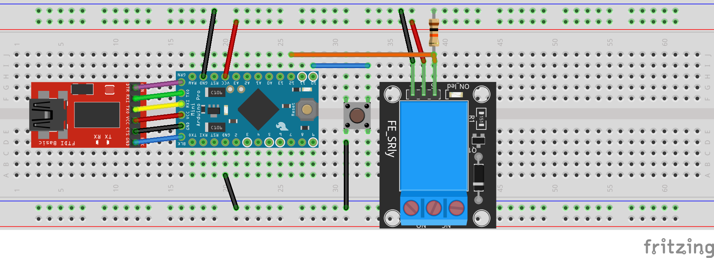

# Activity reminder
This project was made as a effort to become more active during work hours. You are probably asking how does this simple python app does it... Well it just uses arduino with relay that disables USB hub that has keyboard and mouse plugged once in a configured ammount of time untill you do configured ammount of squats

## Hardware requirements

to make this project you will need:
- webcam
- USB hub (you can hack to disable pover for outputs or the whole hub)
- Arduino microcontroller with usb serial comunication
- 5V Relay module
- 10k resistors
- Pushbutton (optional)

### Arduino circuit



**About this circuit:** This circuit uses Arduino Pro Mini with FTDI board for serial communication, a pushbutton that allows the user to pause reminder for another ammount of time and a relay with 10k pulldown resistor on it's signal pin. Relays normally closed pins are connected to the USB power and USB hubs power in.

### What to do with USB hub?

There are 2 options on how you can approach this:
1. is to cut the +5V line comming inside the USB hub from PC and splice the relay in (if the USB hub is not powered)
2. carefully cut the power trace on the USB hub board and then scratch solder mask so you can solder the wires dirrectly to the board and splice the relay in that way

## Setup and Usage

- Flash Arduino code located in `arduino/hub_controller` to your arduino board
- Setup python3 enviroment
  - Create new enviroment with `python3 -m venv env` and enable it `source env\Scripts\activate`
  - Install required packages with `pip3 install -r requirements.txt`
- Generate config file with `python3 config.py`
- Edit config file to meet your requirements (each option explained down)
- Run `python3 activity_reminder.py` to run the whole app

### Config file options explained

```
{
    "allowed_skips": 2, // number of skips allowed between last time the user did the ammount of squats configured (note by using this feature the squat ammount gets increased by half of the squat count times skipped ammount of times)
    "baud": 9600, // baud rate for serial port
    "camera": 0, // OpenCV camera index
    "port": "COM3", // COM/Serial port path
    "squats": 20, // ammount of squats to do after configured ammount of time has passed
    "time": 45 // ammount of time(in minutes) after which you should do squats
}
```

## Known issues

- sometimes hangs on close (I think that one of the threads dont stop)
- can be easily closed
- custom PCB is needed to make this thing smaller